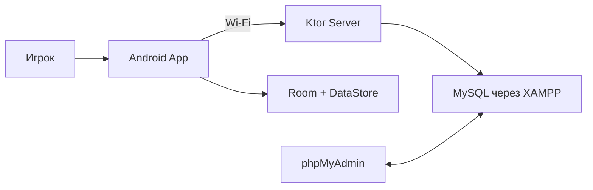
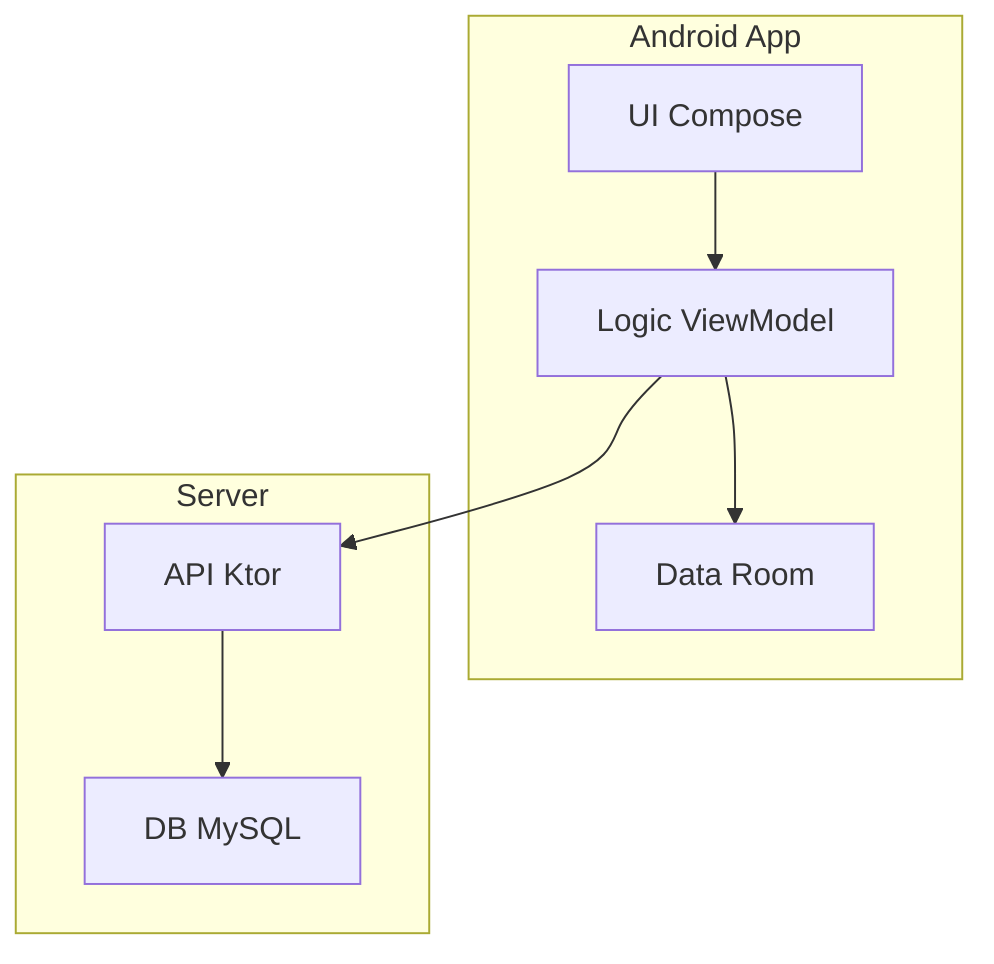
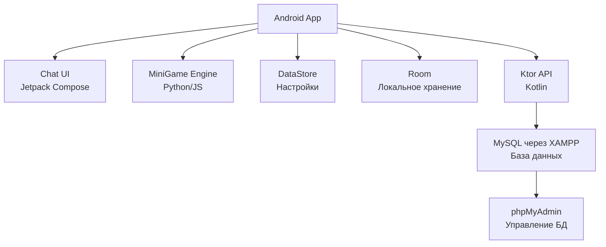
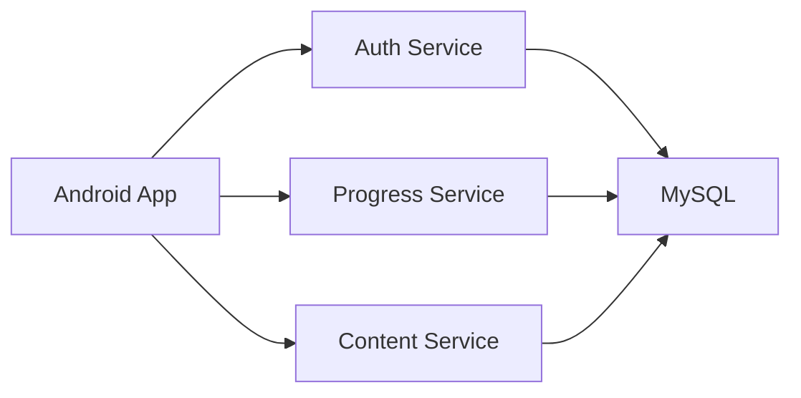
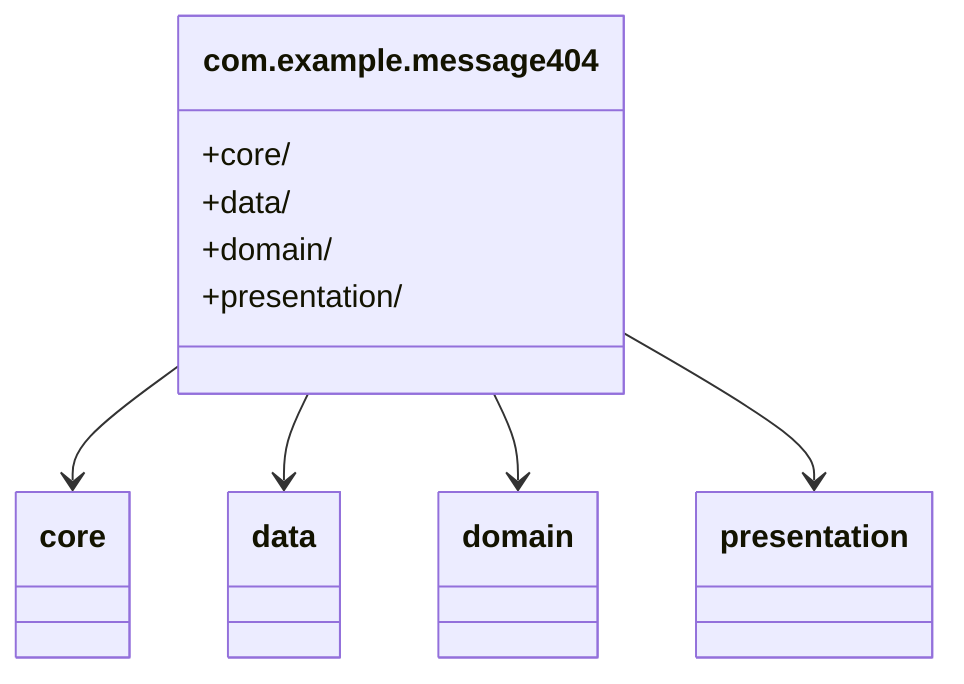
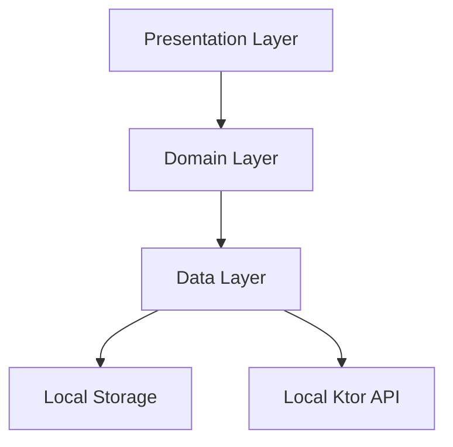
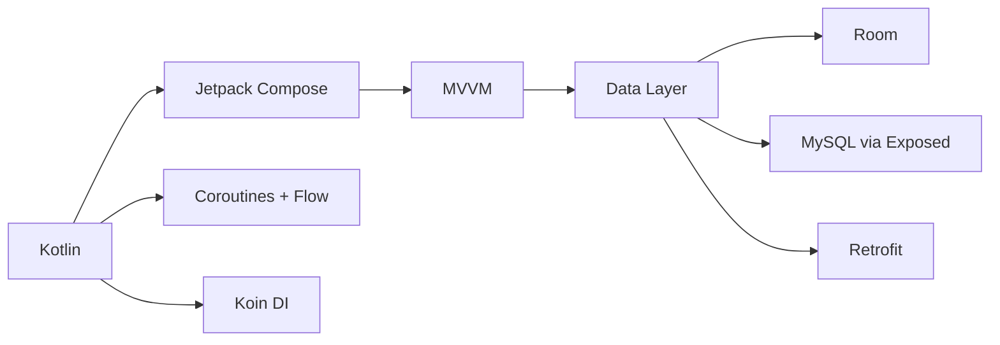

# 📊 Все диаграммы проекта «Сообщение 404»

Этот документ содержит 37 уникальных диаграмм проекта «Сообщение 404» — текстового квеста в жанре психологического детектива для Android. Диаграммы сгруппированы по категориям: архитектурные, данные, API, динамические, игровые, UI/UX и инфраструктурные. Каждая диаграмма представлена в формате Mermaid.js, сопровождается подробным описанием в контексте проекта и расширенным выводом о её применении. Проект использует локальный Ktor-сервер с MySQL через XAMPP, обеспечивая автономность и офлайн-режим, и соответствует требованиям российского законодательства (152-ФЗ, ГОСТ Р 34.12-2015). Все упоминания облачных сервисов (например, Back4App) исключены.

---

## 1. Архитектурные диаграммы

### 1.1. Системный контекст (C4 Level 1)
**Описание:**  
Диаграмма отражает архитектуру автономного мобильного приложения «Сообщение 404» для Android, имитирующего мессенджер с нелинейным сюжетом. Приложение работает офлайн, сохраняя прогресс в Room и DataStore, и синхронизируется с локальным Ktor-сервером по Wi-Fi (IP: 192.168.137.1:8080). Сервер на ноутбуке использует MySQL через XAMPP для хранения данных, а phpMyAdmin — для администрирования. Такой подход полностью исключает облачные сервисы, что критично для соответствия 152-ФЗ и ГОСТ Р 34.12-2015.



**Вывод:**  
Диаграмма даёт целостное представление о системе для всех участников проекта: разработчиков, геймдизайнеров, менеджеров и администраторов. Она подчёркивает автономность, помогает презентовать проект заказчикам, а также служит основой для настройки и тестирования локальной сети и отказоустойчивости.

---

### 1.2. Контейнерная диаграмма (C4 Level 2)
**Описание:**  
Показывает ключевые контейнеры: Android-приложение (Kotlin, Jetpack Compose, MVVM), локальный Ktor-сервер (Kotlin, Exposed ORM), MySQL через XAMPP и phpMyAdmin. Игрок взаимодействует с UI, приложение отправляет HTTP-запросы к серверу по Wi-Fi, сервер сохраняет данные в MySQL. Room обеспечивает офлайн-хранение, синхронизируясь с сервером при появлении сети.



**Вывод:**  
Диаграмма делает архитектуру понятной для нетехнических специалистов и служит ориентиром для разработчиков. Она помогает планировать интеграцию, тестирование офлайн-режима и настройку сервера, а также минимизирует ошибки конфигурации.

---

### 1.3. Компонентная диаграмма (C4 Level 3)
**Описание:**  
Показывает внутренние компоненты Android-приложения: Chat UI (Jetpack Compose), MiniGame Engine (Python/JS), DataStore (настройки), Room (прогресс). Компоненты взаимодействуют с Ktor-сервером через Retrofit для синхронизации. MySQL хранит прогресс, phpMyAdmin — для управления.



**Вывод:**  
Диаграмма определяет модули и их зависимости, упрощая модульное тестирование и отладку. Она поддерживает MVVM и Clean Architecture, облегчает добавление новых функций и помогает QA-инженерам планировать тесты интеграции.

---

### 1.4. Диаграмма развертывания и сетевой топологии
**Описание:**  
Показывает физическое размещение компонентов и Wi-Fi-сеть: ноутбук (Windows/Linux) — точка доступа (IP: 192.168.137.1), хостит Ktor-сервер (8080) и MySQL через XAMPP. Android-устройства подключаются по Wi-Fi для синхронизации прогресса через HTTP-запросы. Room используется в офлайн-режиме. Диаграмма учитывает требования ГОСТ Р 34.12-2015 (TLS 1.2+).

```mermaid
graph TD
    note "Локальная Wi-Fi сеть"
    Laptop[Ноутбук] -->|Wi-Fi| Android1[Телефон 1]
    Laptop -->|Wi-Fi| Android2[Телефон 2]
    Laptop -->|MySQL| MySQL[(game.db)]
    Laptop -->|Ktor| Android1
    Laptop -->|Ktor| Android2
```

**Вывод:**  
Диаграмма — руководство для администраторов и пользователей по настройке локальной сети и сервера. Она минимизирует ошибки конфигурации, обеспечивает стабильную синхронизацию и полезна для DevOps при тестировании инфраструктуры.

---

### 1.5. Микросервисная архитектура
**Описание:**  
Показывает потенциальное разделение Ktor-сервера на микросервисы: Auth (авторизация по userId), Progress (сохранение/получение прогресса), Content (сцены, мини-игры). В текущем MVP используется монолитный Ktor-сервер, но диаграмма полезна для планирования масштабирования, например, при добавлении мультиплеера или поддержки iOS. Все сервисы используют общую MySQL-базу через XAMPP.



**Вывод:**  
Диаграмма помогает продакт-менеджерам и архитекторам спланировать долгосрочное развитие проекта. Для MVP она подтверждает оптимальность монолитной архитектуры, снижая сложность разработки. Также упрощает обсуждение с инвесторами или заказчиками, демонстрируя масштабируемость системы.

---

### 1.6. Диаграмма модулей
**Описание:**  
Диаграмма описывает структуру пакетов Android-приложения: core (утилиты, Koin DI), data (репозитории, Room, Retrofit), domain (UseCase, бизнес-логика), presentation (ViewModel, Jetpack Compose). Это соответствует Clean Architecture и MVVM, обеспечивая модульность и тестируемость. Пакеты минимизируют зависимости, поддерживая офлайн-режим и синхронизацию.



**Вывод:**  
Диаграмма упрощает онбординг новых разработчиков, обеспечивая чёткую навигацию по коду. Она поддерживает модульное тестирование (Mockito) и расширение (например, добавление аналитики). Также помогает соблюдать стандарты MVVM, что критично для долгосрочной поддержки проекта.

---

### 1.7. Диаграмма слоев
**Описание:**  
Диаграмма иллюстрирует архитектурные слои приложения: Presentation (Jetpack Compose, ViewModel), Domain (UseCase), Data (Room, DataStore, Retrofit → Ktor API). Слои разделяют ответственность, поддерживая офлайн-режим (Room) и синхронизацию (Retrofit). Это соответствует Clean Architecture, упрощая тестирование и масштабирование.



**Вывод:**  
Диаграмма обеспечивает соблюдение Clean Architecture, упрощая модульное тестирование и поддержку кода. Она помогает новым разработчикам понять архитектуру и добавлять новые функции (например, новые мини-игры), минимизируя риски регрессий. Также полезна для QA при тестировании слоёв.

---

### 1.8. Диаграмма зависимостей
**Описание:**  
Диаграмма показывает зависимости библиотек: Kotlin (1.9.x), Jetpack Compose (1.6.x), Coroutines/Flow, Koin (DI), Room, Retrofit (HTTP), Exposed (ORM для Ktor). Это помогает управлять версиями в build.gradle.kts, избегая конфликтов и поддерживая производительность на устройствах с API 21+.



**Вывод:**  
Диаграмма предотвращает конфликты библиотек, упрощая настройку Gradle и оптимизацию сборки. Она полезна для разработчиков при обновлении зависимостей и тестировании совместимости, особенно при добавлении новых функций (например, AdMob). Также помогает менеджерам оценить технические риски.

--- 