# Все диаграммы проекта «Сообщение 404»

Этот документ содержит 30 диаграмм проекта «Сообщение 404» — текстового квеста в жанре психологического детектива для Android (API 21+). Диаграммы сгруппированы по категориям: архитектурные, данные, API, динамические, игровые, UI/UX и инфраструктурные. Каждая диаграмма представлена в формате Mermaid.js, включает детальное описание в контексте проекта и расширенный вывод о применении. Проект использует Kotlin, Jetpack Compose, MVVM, тёмную тему, офлайн-режим, локальный Ktor-сервер (IP: 192.168.137.1:8080) с MySQL через XAMPP и phpMyAdmin, обеспечивая автономность и соответствие российскому законодательству (152-ФЗ, ГОСТ Р 34.12-2015). Все дубликаты исключены, каждая диаграмма уникальна и относится к одной категории.

## 1. Архитектурные диаграммы

### 1.1. Контейнерная диаграмма (C4 Level 2)

**Описание:** Диаграмма описывает контейнеры системы: Android-приложение (Kotlin, Jetpack Compose, MVVM) имитирует мессенджер с чатами, выборами и мини-играми (Python/JS). Игрок взаимодействует через UI, приложение сохраняет прогресс локально в Room и DataStore (офлайн-режим) и синхронизируется с Ktor-сервером по Wi-Fi (HTTP, TLS 1.2+). Сервер, запущенный на ноутбуке, использует MySQL через XAMPP (база game.db, таблицы: users, game_progress) для хранения прогресса, а phpMyAdmin (порт 80) предоставляет интерфейс управления. Это обеспечивает автономность, исключая интернет-зависимость, и соответствует 152-ФЗ (защита данных).

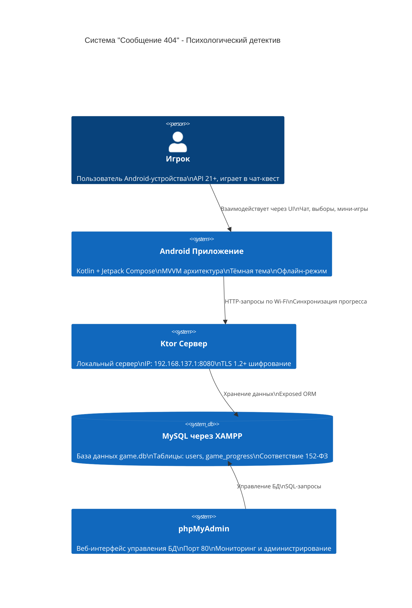
```mermaid
C4Context
    title Система "Сообщение 404" - Психологический детектив
    Person(игрок, "Игрок", "Пользователь Android-устройства\nAPI 21+, играет в чат-квест")
    System(androidПриложение, "Android Приложение", "Kotlin + Jetpack Compose\nMVVM архитектура\nТёмная тема\nОфлайн-режим")
    System(сервер, "Ktor Сервер", "Локальный сервер\nIP: 192.168.137.1:8080\nTLS 1.2+ шифрование")
    SystemDb(базаДанных, "MySQL через XAMPP", "База данных game.db\nТаблицы: users, game_progress\nСоответствие 152-ФЗ")
    System(админПанель, "phpMyAdmin", "Веб-интерфейс управления БД\nПорт 80\nМониторинг и администрирование")
    Rel(игрок, androidПриложение, "Взаимодействует через UI\nЧат, выборы, мини-игры")
    Rel(androidПриложение, сервер, "HTTP-запросы по Wi-Fi\nСинхронизация прогресса")
    Rel(сервер, базаДанных, "Хранение данных\nExposed ORM")
    Rel(админПанель, базаДанных, "Управление БД\nSQL-запросы")
```

**Вывод:** Диаграмма предоставляет целостный обзор системы, понятный разработчикам, геймдизайнерам и менеджерам. Она помогает настроить локальную сеть (Wi-Fi, XAMPP), спланировать интеграцию (Room ↔ Ktor ↔ MySQL) и тестирование офлайн-режима. Для администраторов она упрощает установку сервера, а для заказчиков — демонстрирует автономность и безопасность.

### 1.2. Компонентная диаграмма (C4 Level 3)

**Описание:** Диаграмма детализирует компоненты Android-приложения: Chat UI (Compose, пузырьки сообщений, тёмная тема), MiniGame Engine (интерпретатор Python/JS для задач по коду), DataStore (настройки, например, тёмная тема), Room (локальное хранение сцен, выборов). Компоненты взаимодействуют через MVVM, синхронизируясь с Ktor-сервером (Retrofit, POST /progress) и MySQL через XAMPP. phpMyAdmin используется для просмотра данных (например, scene_history).

```mermaid
C4Container
    title Компоненты системы "Сообщение 404"
    Enterprise_Boundary(система404) {
        Container(androidПриложение, "Android Приложение", "Kotlin + Jetpack Compose\nAPI 21+\nMVVM архитектура")
        Container(ktorСервер, "Ktor API Сервер", "Kotlin сервер\nHTTP/JSON API\nTLS 1.2+")
        Container(mysqlБаза, "MySQL База данных", "XAMPP окружение\nБаза game.db\nТаблицы: users, progress")
        Container(админПанель, "phpMyAdmin", "Веб-интерфейс\nУправление БД\nМониторинг")
        Container(чатИнтерфейс, "Чат UI Компонент", "Jetpack Compose\nПузырьки сообщений\nТёмная тема")
        Container(движокИгр, "Движок Мини-игр", "Python/JS интерпретатор\nЗадачи по программированию\n6 игр в день")
        Container(хранилищеДанных, "DataStore Компонент", "Настройки приложения\nТёмная тема\nПользовательские предпочтения")
        Container(локальнаяБаза, "Room База данных", "Локальное хранение\nSQLite\nОфлайн-режим")
    }
    Rel(чатИнтерфейс, хранилищеДанных, "Сохраняет настройки\nТёмная тема")
    Rel(чатИнтерфейс, движокИгр, "Вызов мини-игры\nПередача параметров")
    Rel(движокИгр, локальнаяБаза, "Сохраняет результат\nПрогресс игрока")
    Rel(androidПриложение, ktorСервер, "Синхронизация по Wi-Fi\nRetrofit клиент")
    Rel(ktorСервер, mysqlБаза, "Хранение прогресса\nExposed ORM")
    Rel(админПанель, mysqlБаза, "Управление БД\nSQL-запросы")
```

**Вывод:** Диаграмма помогает разработчикам реализовать модули, поддерживая MVVM и Clean Architecture. Она упрощает модульное тестирование (JUnit для репозиториев, Espresso для UI) и добавление функций (например, аналитика). QA используют её для тестирования интеграции, а геймдизайнеры — для понимания связи чата и мини-игр.

### 1.3. Диаграмма развертывания и сетевой топологии

**Описание:** Диаграмма показывает физическое размещение и Wi-Fi-сеть: ноутбук (Windows/Linux, IP: 192.168.137.1) хостит точку доступа, Ktor-сервер (порт 8080) и MySQL через XAMPP (база game.db). Android-устройства подключаются по Wi-Fi для синхронизации (HTTP, TLS 1.2+). Данные шифруются (AES-256 в Room, TLS на сервере), соответствуя ГОСТ Р 34.12-2015. Room обеспечивает офлайн-режим, минимизируя зависимость от сети.

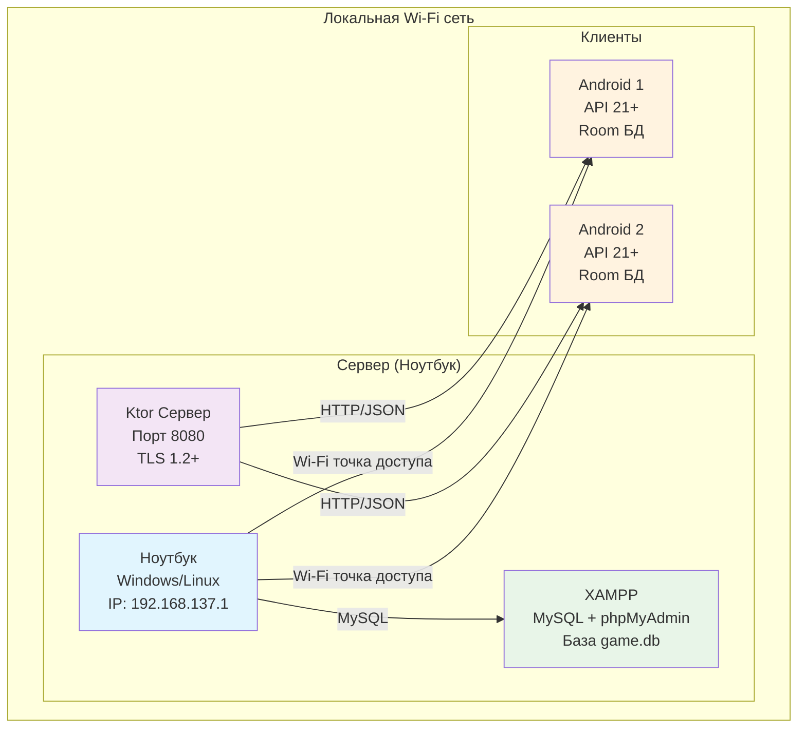
```mermaid
graph TD
    subgraph "Локальная Wi-Fi сеть"
        subgraph "Сервер (Ноутбук)"
            ноутбук[Ноутбук<br/>Windows/Linux<br/>IP: 192.168.137.1]
            ktorСервер[Ktor Сервер<br/>Порт 8080<br/>TLS 1.2+]
            xampp[XAMPP<br/>MySQL + phpMyAdmin<br/>База game.db]
        end
        subgraph "Клиенты"
            телефон1[Android 1<br/>API 21+<br/>Room БД]
            телефон2[Android 2<br/>API 21+<br/>Room БД]
        end
    end
    ноутбук -->|Wi-Fi точка доступа| телефон1
    ноутбук -->|Wi-Fi точка доступа| телефон2
    ноутбук -->|MySQL| xampp
    ktorСервер -->|HTTP/JSON| телефон1
    ktorСервер -->|HTTP/JSON| телефон2
    style ноутбук fill:#e1f5fe
    style ktorСервер fill:#f3e5f5
    style xampp fill:#e8f5e8
    style телефон1 fill:#fff3e0
    style телефон2 fill:#fff3e0
```

**Вывод:** Диаграмма — руководство для администраторов по настройке Wi-Fi, XAMPP и Ktor. Она минимизирует ошибки конфигурации, обеспечивая стабильную синхронизацию. Разработчики используют её для реализации TLS, а QA — для тестирования офлайн-режима. Менеджеры могут презентовать автономность заказчикам.

### 1.4. Микросервисная архитектура

**Описание:** Диаграмма показывает потенциальное разделение Ktor-сервера на микросервисы: Auth (/auth), Progress (/progress, /save-progress), Content (/scenes, /mini-game). В MVP используется монолитный Ktor, но диаграмма планирует масштабирование, например, для мультиплеера. Все сервисы используют MySQL через XAMPP.

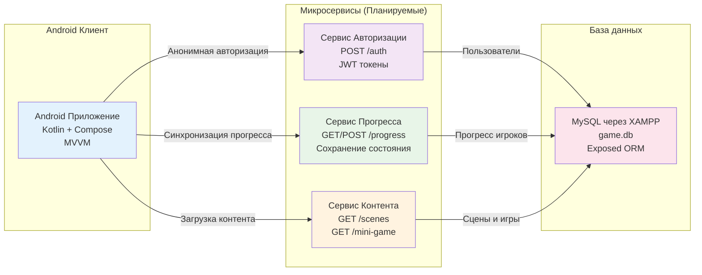
```mermaid
graph LR
    subgraph "Android Клиент"
        приложение[Android Приложение<br/>Kotlin + Compose<br/>MVVM]
    end
    subgraph "Микросервисы (Планируемые)"
        сервисАвторизации[Сервис Авторизации<br/>POST /auth<br/>JWT токены]
        сервисПрогресса[Сервис Прогресса<br/>GET/POST /progress<br/>Сохранение состояния]
        сервисКонтента[Сервис Контента<br/>GET /scenes<br/>GET /mini-game]
    end
    subgraph "База данных"
        базаДанных[MySQL через XAMPP<br/>game.db<br/>Exposed ORM]
    end
    приложение -->|Анонимная авторизация| сервисАвторизации
    приложение -->|Синхронизация прогресса| сервисПрогресса
    приложение -->|Загрузка контента| сервисКонтента
    сервисАвторизации -->|Пользователи| базаДанных
    сервисПрогресса -->|Прогресс игроков| базаДанных
    сервисКонтента -->|Сцены и игры| базаДанных
    style приложение fill:#e3f2fd
    style сервисАвторизации fill:#f3e5f5
    style сервисПрогресса fill:#e8f5e8
    style сервисКонтента fill:#fff3e0
    style базаДанных fill:#fce4ec
```

**Вывод:** Диаграмма помогает архитекторам спланировать масштабирование, сохраняя простоту MVP. Она полезна для менеджеров при обсуждении с инвесторами, демонстрируя гибкость. Разработчики используют её для оценки монолитной архитектуры, минимизируя сложность.

### 1.5. Диаграмма модулей

**Описание:** Диаграмма описывает структуру пакетов приложения: core (утилиты, Koin DI), data (Room, Retrofit, репозитории), domain (UseCase), presentation (ViewModel, Compose). Это обеспечивает модульность, тестируемость и офлайн-режим, поддерживая Clean Architecture.

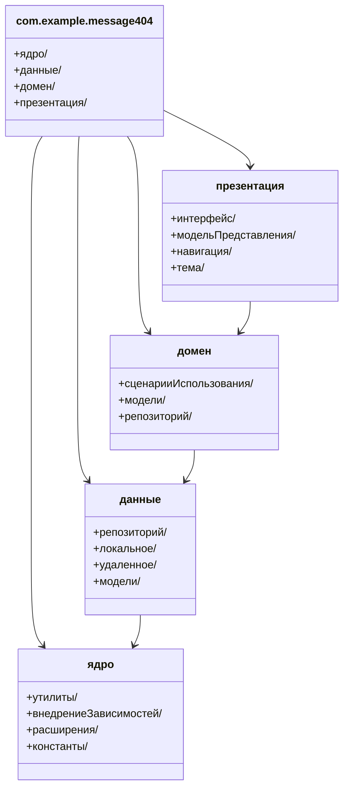
```mermaid
classDiagram
    class com.example.message404 {
        +ядро/
        +данные/
        +домен/
        +презентация/
    }
    class ядро {
        +утилиты/
        +внедрениеЗависимостей/
        +расширения/
        +константы/
    }
    class данные {
        +репозиторий/
        +локальное/
        +удаленное/
        +модели/
    }
    class домен {
        +сценарииИспользования/
        +модели/
        +репозиторий/
    }
    class презентация {
        +интерфейс/
        +модельПредставления/
        +навигация/
        +тема/
    }
    com.example.message404 --> ядро
    com.example.message404 --> данные
    com.example.message404 --> домен
    com.example.message404 --> презентация
    данные --> ядро
    домен --> данные
    презентация --> домен
```

**Вывод:** Диаграмма упрощает онбординг разработчиков, обеспечивая навигацию по коду. Она поддерживает модульное тестирование (Mockito) и расширение (например, аналитика). QA используют её для проверки зависимостей, минимизируя регрессии.

### 1.6. Диаграмма слоев

**Описание:** Диаграмма иллюстрирует слои: Presentation (Compose, ViewModel), Domain (UseCase), Data (Room, DataStore, Retrofit). Это разделяет ответственность, поддерживая офлайн-режим (Room) и синхронизацию (Retrofit → Ktor). Соответствует Clean Architecture.

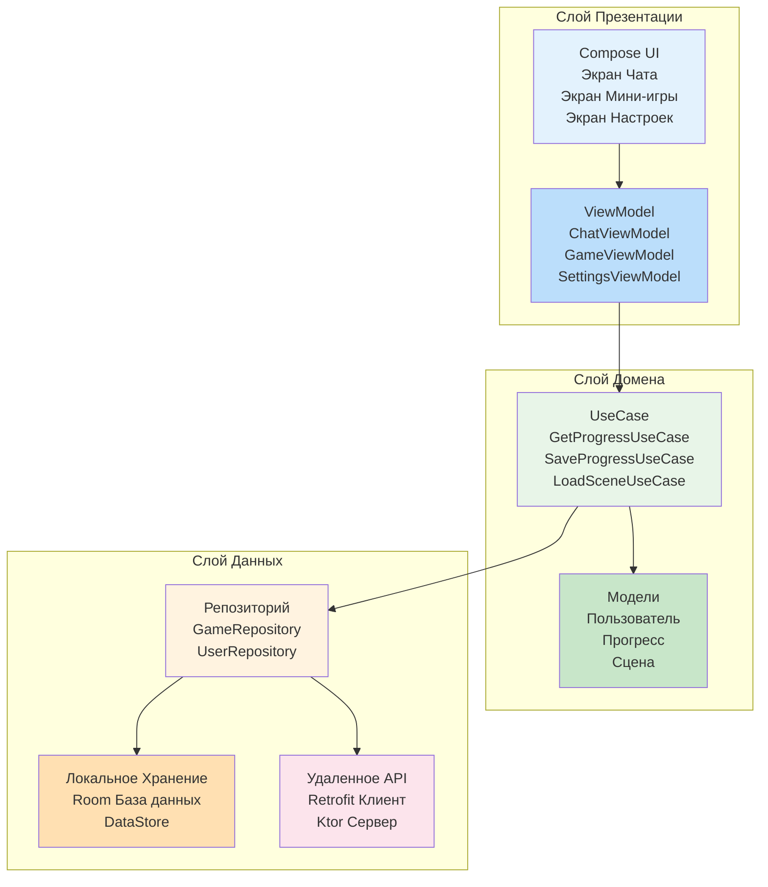
```mermaid
graph TB
    subgraph "Слой Презентации"
        интерфейс[Compose UI<br/>Экран Чата<br/>Экран Мини-игры<br/>Экран Настроек]
        модельПредставления[ViewModel<br/>ChatViewModel<br/>GameViewModel<br/>SettingsViewModel]
    end
    subgraph "Слой Домена"
        сценарииИспользования[UseCase<br/>GetProgressUseCase<br/>SaveProgressUseCase<br/>LoadSceneUseCase]
        модели[Модели<br/>Пользователь<br/>Прогресс<br/>Сцена]
    end
    subgraph "Слой Данных"
        репозиторий[Репозиторий<br/>GameRepository<br/>UserRepository]
        локальноеХранение[Локальное Хранение<br/>Room База данных<br/>DataStore]
        удаленноеAPI[Удаленное API<br/>Retrofit Клиент<br/>Ktor Сервер]
    end
    интерфейс --> модельПредставления
    модельПредставления --> сценарииИспользования
    сценарииИспользования --> модели
    сценарииИспользования --> репозиторий
    репозиторий --> локальноеХранение
    репозиторий --> удаленноеAPI
    style интерфейс fill:#e3f2fd
    style модельПредставления fill:#bbdefb
    style сценарииИспользования fill:#e8f5e8
    style модели fill:#c8e6c9
    style репозиторий fill:#fff3e0
    style локальноеХранение fill:#ffe0b2
    style удаленноеAPI fill:#fce4ec
```

**Вывод:** Диаграмма помогает разработчикам соблюдать Clean Architecture, упрощая тестирование и поддержку. Она полезна для QA при проверке слоёв и для менеджеров при оценке архитектурных рисков. Также облегчает добавление функций (например, новые мини-игры).

### 1.7. Диаграмма зависимостей

**Описание:** Диаграмма показывает библиотеки: Kotlin (1.9.x), Jetpack Compose (1.6.x), Coroutines/Flow, Koin, Room, Retrofit, Exposed (ORM для Ktor). Это управляет версиями в build.gradle.kts, обеспечивая совместимость на API 21+.

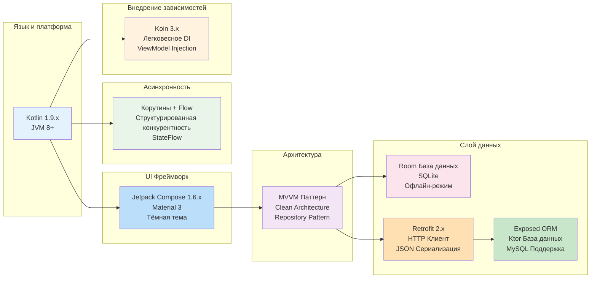
```mermaid
graph LR
    subgraph "Язык и платформа"
        kotlin[Kotlin 1.9.x<br/>JVM 8+]
    end
    subgraph "UI Фреймворк"
        compose[Jetpack Compose 1.6.x<br/>Material 3<br/>Тёмная тема]
    end
    subgraph "Асинхронность"
        корутины[Корутины + Flow<br/>Структурированная конкурентность<br/>StateFlow]
    end
    subgraph "Внедрение зависимостей"
        koin[Koin 3.x<br/>Легковесное DI<br/>ViewModel Injection]
    end
    subgraph "Архитектура"
        mvvm[MVVM Паттерн<br/>Clean Architecture<br/>Repository Pattern]
    end
    subgraph "Слой данных"
        room[Room База данных<br/>SQLite<br/>Офлайн-режим]
        retrofit[Retrofit 2.x<br/>HTTP Клиент<br/>JSON Сериализация]
        exposed[Exposed ORM<br/>Ktor База данных<br/>MySQL Поддержка]
    end
    kotlin --> compose
    kotlin --> корутины
    kotlin --> koin
    compose --> mvvm
    mvvm --> room
    mvvm --> retrofit
    retrofit --> exposed
    style kotlin fill:#e3f2fd
    style compose fill:#bbdefb
    style корутины fill:#e8f5e8
    style koin fill:#fff3e0
    style mvvm fill:#f3e5f5
    style room fill:#fce4ec
    style retrofit fill:#ffe0b2
    style exposed fill:#c8e6c9
```

**Вывод:** Диаграмма предотвращает конфликты библиотек, упрощая настройку Gradle. Разработчики используют её для обновления зависимостей, а QA — для тестирования совместимости. Менеджеры оценивают технические риски, планируя обновления.

## 2. Диаграммы данных

### 2.1. Концептуальная модель данных

**Описание:** Диаграмма описывает сущности: Пользователь (анонимный userId), Прогресс (день, сцена), Выборы (диалоги с NPC), Мини-игры (Python/JS задачи), Концовки (финалы). Это основа для сюжета (10 дней, 60+ путей) и базы данных, поддерживающая ветвление и моральные дилеммы.

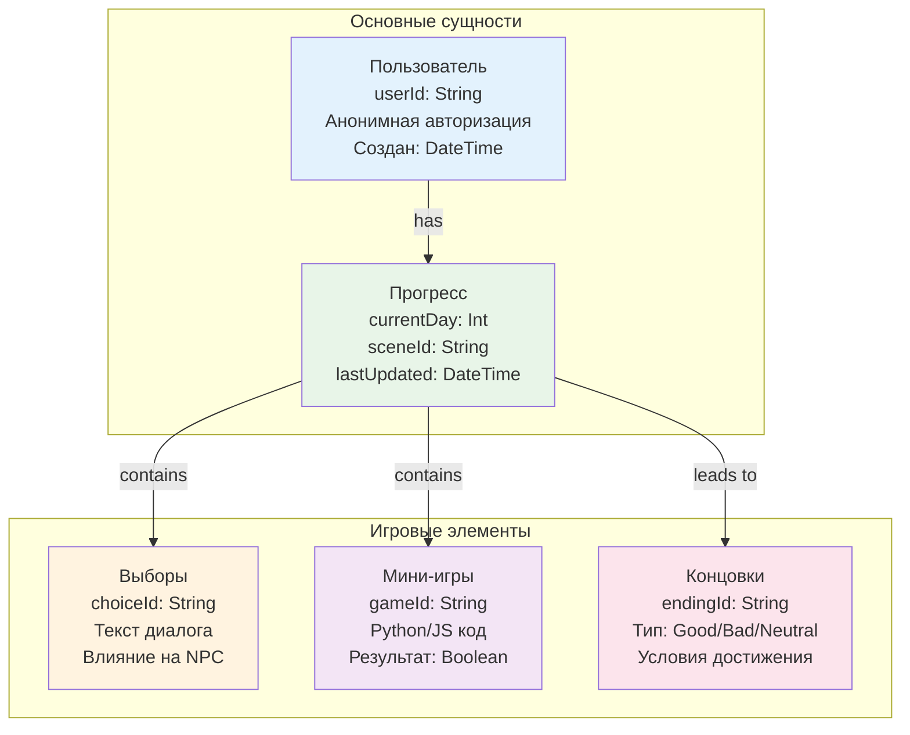
```mermaid
graph TD
    subgraph "Основные сущности"
        A[Пользователь<br/>userId: String<br/>Анонимная авторизация<br/>Создан: DateTime]
        B[Прогресс<br/>currentDay: Int<br/>sceneId: String<br/>lastUpdated: DateTime]
    end
    subgraph "Игровые элементы"
        C[Выборы<br/>choiceId: String<br/>Текст диалога<br/>Влияние на NPC]
        D[Мини-игры<br/>gameId: String<br/>Python/JS код<br/>Результат: Boolean]
        E[Концовки<br/>endingId: String<br/>Тип: Good/Bad/Neutral<br/>Условия достижения]
    end
    A -->|has| B
    B -->|contains| C
    B -->|contains| D
    B -->|leads to| E
    style A fill:#e3f2fd
    style B fill:#e8f5e8
    style C fill:#fff3e0
    style D fill:#f3e5f5
    style E fill:#fce4ec
```

**Вывод:** Диаграмма связывает геймдизайн и разработку, помогая сценаристам проектировать сюжет, а разработчикам — базу данных. Она упрощает тестирование сюжетных путей, обеспечивая разнообразие и офлайн-доступ к данным.

### 2.2. Логическая модель данных

**Описание:** Диаграмма детализирует связи: Пользователь → Прогресс → Сцены (10 дней), Флаги (доверие, угроза), Мини-игры (6 на день). Выборы определяют переходы сцен, влияя на отношения с NPC (Алексей, Елена). Это основа для Room и MySQL.

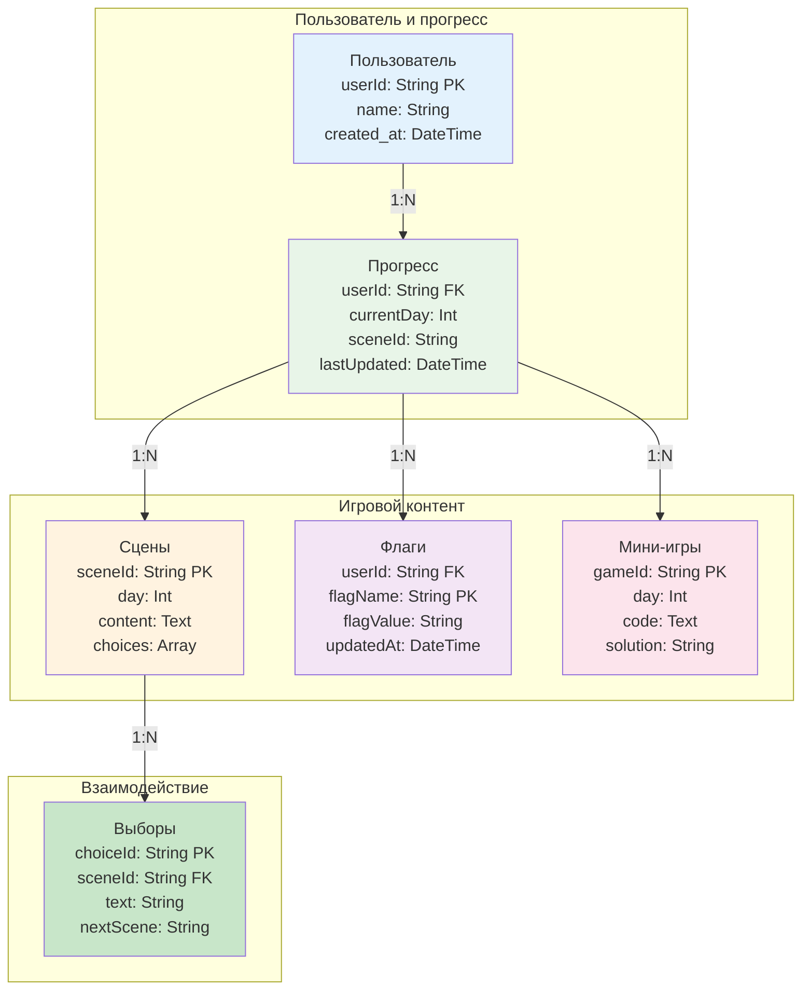
```mermaid
graph TD
    subgraph "Пользователь и прогресс"
        A[Пользователь<br/>userId: String PK<br/>name: String<br/>created_at: DateTime]
        B[Прогресс<br/>userId: String FK<br/>currentDay: Int<br/>sceneId: String<br/>lastUpdated: DateTime]
    end
    subgraph "Игровой контент"
        C[Сцены<br/>sceneId: String PK<br/>day: Int<br/>content: Text<br/>choices: Array]
        D[Флаги<br/>userId: String FK<br/>flagName: String PK<br/>flagValue: String<br/>updatedAt: DateTime]
        E[Мини-игры<br/>gameId: String PK<br/>day: Int<br/>code: Text<br/>solution: String]
    end
    subgraph "Взаимодействие"
        F[Выборы<br/>choiceId: String PK<br/>sceneId: String FK<br/>text: String<br/>nextScene: String]
    end
    A -->|1:N| B
    B -->|1:N| C
    B -->|1:N| D
    B -->|1:N| E
    C -->|1:N| F
    style A fill:#e3f2fd
    style B fill:#e8f5e8
    style C fill:#fff3e0
    style D fill:#f3e5f5
    style E fill:#fce4ec
    style F fill:#c8e6c9
```

**Вывод:** Диаграмма помогает геймдизайнерам создавать сложные сюжеты, а разработчикам — репозитории и UseCase. QA используют её для тестирования влияния выборов, обеспечивая целостность сюжета и данных.

### 2.3. Физическая модель данных (ERD)

**Описание:** Диаграмма описывает таблицы MySQL: users (userId, name), game_progress (день, сцена, выборы, мини-игры), scene_history (история сцен), flags (доверие, угроза). Room зеркалирует структуру, синхронизируясь через Retrofit. Exposed используется в Ktor.

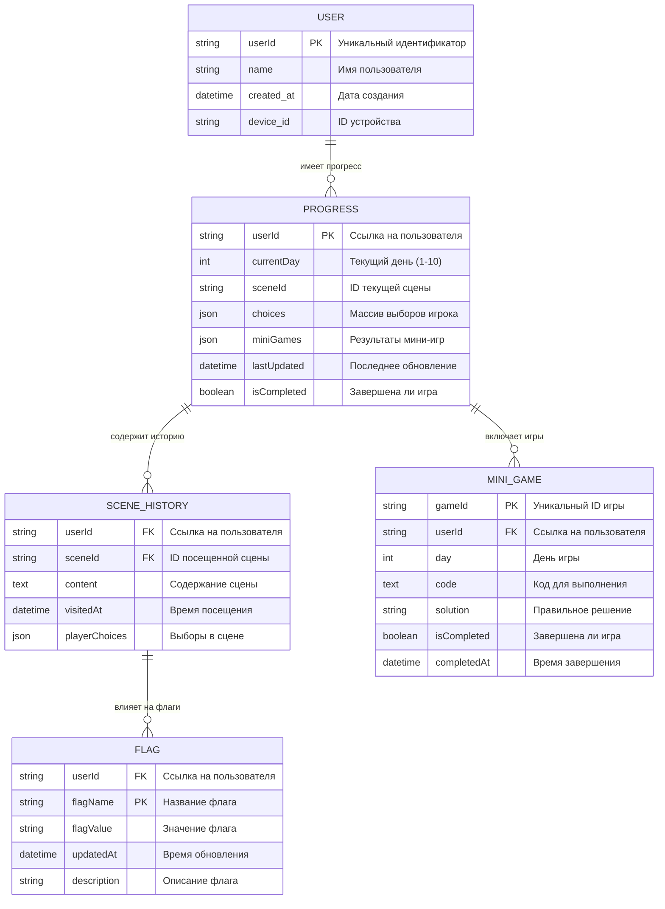
```mermaid
erDiagram
    USER ||--o{ PROGRESS : "имеет прогресс"
    PROGRESS ||--o{ SCENE_HISTORY : "содержит историю"
    SCENE_HISTORY ||--o{ FLAG : "влияет на флаги"
    PROGRESS ||--o{ MINI_GAME : "включает игры"
    
    USER {
        string userId PK "Уникальный идентификатор"
        string name "Имя пользователя"
        datetime created_at "Дата создания"
        string device_id "ID устройства"
    }
    
    PROGRESS {
        string userId PK "Ссылка на пользователя"
        int currentDay "Текущий день (1-10)"
        string sceneId "ID текущей сцены"
        json choices "Массив выборов игрока"
        json miniGames "Результаты мини-игр"
        datetime lastUpdated "Последнее обновление"
        boolean isCompleted "Завершена ли игра"
    }
    
    SCENE_HISTORY {
        string userId FK "Ссылка на пользователя"
        string sceneId FK "ID посещенной сцены"
        text content "Содержание сцены"
        datetime visitedAt "Время посещения"
        json playerChoices "Выборы в сцене"
    }
    
    FLAG {
        string userId FK "Ссылка на пользователя"
        string flagName PK "Название флага"
        string flagValue "Значение флага"
        datetime updatedAt "Время обновления"
        string description "Описание флага"
    }
    
    MINI_GAME {
        string gameId PK "Уникальный ID игры"
        string userId FK "Ссылка на пользователя"
        int day "День игры"
        text code "Код для выполнения"
        string solution "Правильное решение"
        boolean isCompleted "Завершена ли игра"
        datetime completedAt "Время завершения"
    }
```

**Вывод:** Диаграмма — основа для настройки MySQL и Room. Она упрощает SQL-запросы, управление через phpMyAdmin и тестирование целостности. Разработчики оптимизируют запросы, минимизируя задержки синхронизации.

### 2.4. Диаграмма хранилищ данных

**Описание:** Диаграмма показывает хранилища: Room (прогресс, выборы), DataStore (настройки, тёмная тема), MySQL (серверное хранение). Это управляет данными, поддерживая офлайн-режим и синхронизацию.

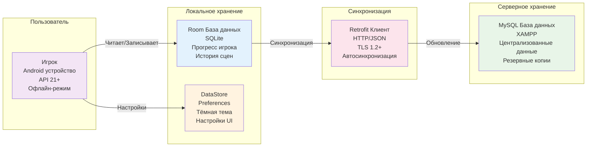
```mermaid
graph LR
    subgraph "Локальное хранение"
        A[Room База данных<br/>SQLite<br/>Прогресс игрока<br/>История сцен]
        E[DataStore<br/>Preferences<br/>Тёмная тема<br/>Настройки UI]
    end
    subgraph "Серверное хранение"
        C[MySQL База данных<br/>XAMPP<br/>Централизованные данные<br/>Резервные копии]
    end
    subgraph "Пользователь"
        F[Игрок<br/>Android устройство<br/>API 21+<br/>Офлайн-режим]
    end
    subgraph "Синхронизация"
        G[Retrofit Клиент<br/>HTTP/JSON<br/>TLS 1.2+<br/>Автосинхронизация]
    end
    F -->|Читает/Записывает| A
    F -->|Настройки| E
    A -->|Синхронизация| G
    G -->|Обновление| C
    style A fill:#e3f2fd
    style E fill:#fff3e0
    style C fill:#e8f5e8
    style F fill:#f3e5f5
    style G fill:#fce4ec
```

**Вывод:** Диаграмма помогает разработчикам реализовать очистку кэша или резервное копирование. Администраторы используют её для настройки MySQL, а QA — для тестирования синхронизации, минимизируя риск потери данных.

### 2.5. Диаграмма миграции данных

**Описание:** Диаграмма описывает перенос данных: JSON-файлы (сцены, диалоги) импортируются в Room при установке, затем синхронизируются с MySQL через Ktor. Это важно для обновления контента или миграции версий.

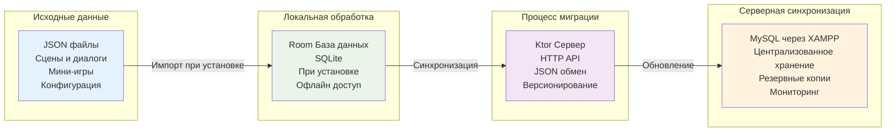
```mermaid
graph LR
    subgraph "Исходные данные"
        A[JSON файлы<br/>Сцены и диалоги<br/>Мини-игры<br/>Конфигурация]
    end
    subgraph "Локальная обработка"
        B[Room База данных<br/>SQLite<br/>При установке<br/>Офлайн доступ]
    end
    subgraph "Серверная синхронизация"
        C[MySQL через XAMPP<br/>Централизованное хранение<br/>Резервные копии<br/>Мониторинг]
    end
    subgraph "Процесс миграции"
        D[Ktor Сервер<br/>HTTP API<br/>JSON обмен<br/>Версионирование]
    end
    A -->|Импорт при установке| B
    B -->|Синхронизация| D
    D -->|Обновление| C
    style A fill:#e3f2fd
    style B fill:#e8f5e8
    style C fill:#fff3e0
    style D fill:#f3e5f5
```

**Вывод:** Диаграмма помогает разработчикам спланировать миграцию без потерь, а QA — тестировать процесс. Геймдизайнеры используют её для обновления контента (например, новые дни), минимизируя ошибки.

## 3. Диаграммы API

### 3.1. Диаграмма конечных точек

**Описание:** Диаграмма описывает Ktor-эндпоинты: /auth (анонимная авторизация, { "userId": "ANON_123" }), /progress (получение прогресса), /save-progress (сохранение, { "day": 1, "choices": [...] }), /scenes (загрузка сцен), /mini-game (данные мини-игр). Все запросы используют TLS 1.2+ и JSON, с кодами ошибок (400, 404).

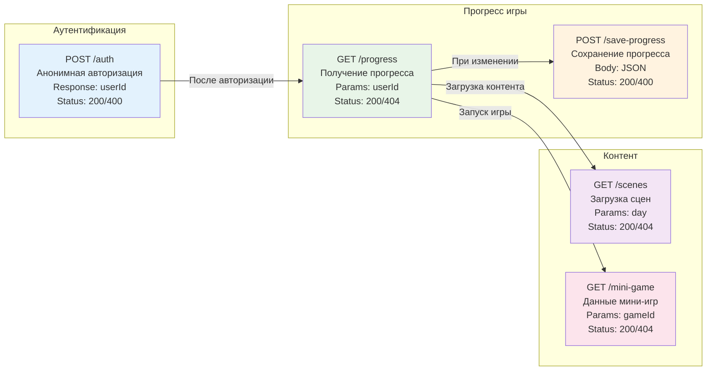
```mermaid
graph LR
    subgraph "Аутентификация"
        A[POST /auth<br/>Анонимная авторизация<br/>Response: userId<br/>Status: 200/400]
    end
    subgraph "Прогресс игры"
        B[GET /progress<br/>Получение прогресса<br/>Params: userId<br/>Status: 200/404]
        C[POST /save-progress<br/>Сохранение прогресса<br/>Body: JSON<br/>Status: 200/400]
    end
    subgraph "Контент"
        D[GET /scenes<br/>Загрузка сцен<br/>Params: day<br/>Status: 200/404]
        E[GET /mini-game<br/>Данные мини-игр<br/>Params: gameId<br/>Status: 200/404]
    end
    A -->|После авторизации| B
    B -->|При изменении| C
    B -->|Загрузка контента| D
    B -->|Запуск игры| E
    style A fill:#e3f2fd
    style B fill:#e8f5e8
    style C fill:#fff3e0
    style D fill:#f3e5f5
    style E fill:#fce4ec
```

**Вывод:** Диаграмма упрощает разработку Retrofit-клиента и Ktor-роутов, а также тестирование API (Postman). QA создают тест-кейсы, а менеджеры планируют расширение API (например, аналитика). Она обеспечивает стабильность и документирование.

### 3.2. Диаграмма состояний API

**Описание:** Диаграмма показывает состояния API: Активен (сервер доступен), Временно недоступен (нет Wi-Fi), Заблокирован (лимит 10 подключений). Это реализует отказоустойчивость на клиенте (уведомления об оффлайне).

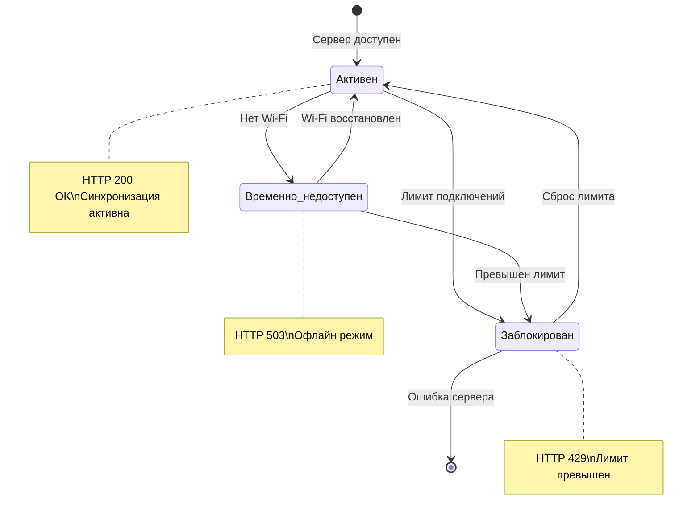
```mermaid
stateDiagram-v2
    [*] --> Активен : Сервер доступен
    Активен --> Временно_недоступен : Нет Wi-Fi
    Активен --> Заблокирован : Лимит подключений
    Временно_недоступен --> Активен : Wi-Fi восстановлен
    Временно_недоступен --> Заблокирован : Превышен лимит
    Заблокирован --> Активен : Сброс лимита
    Заблокирован --> [*] : Ошибка сервера
    note right of Активен : HTTP 200 OK\nСинхронизация активна
    note right of Временно_недоступен : HTTP 503\nОфлайн режим
    note right of Заблокирован : HTTP 429\nЛимит превышен
```

**Вывод:** Диаграмма улучшает UX, помогая разработчикам реализовать ретраи. QA тестируют сбои Wi-Fi, а администраторы используют её для настройки лимитов, повышая стабильность.

### 3.3. Диаграмма версионирования API

**Описание:** Диаграмма показывает эволюцию API: /api/v1/progress → /api/v2/progress. Это обеспечивает совместимость при обновлениях (например, новые поля в JSON).

```mermaid
graph LR
    subgraph "Версия 1.0"
        A[/api/v1/progress<br/>Базовый функционал<br/>userId, day, sceneId]
        B[/api/v1/auth<br/>Простая авторизация<br/>Анонимный доступ]
    end
    subgraph "Версия 2.0"
        C[/api/v2/progress<br/>Расширенный прогресс<br/>+ flags, achievements]
        D[/api/v2/auth<br/>JWT токены<br/>+ refresh tokens]
        E[/api/v2/analytics<br/>Новая функция<br/>Статистика игроков]
    end
    A -->|Миграция| C
    B -->|Обновление| D
    C -->|Новая функция| E
    style A fill:#e3f2fd
    style B fill:#e8f5e8
    style C fill:#fff3e0
    style D fill:#f3e5f5
    style E fill:#fce4ec
```

**Вывод:** Диаграмма помогает разработчикам поддерживать старые версии, а QA — тестировать совместимость. Менеджеры планируют обновления API, минимизируя риски для пользователей.

### 3.4. Диаграмма ограничений API

**Описание:** Диаграмма описывает ограничения: 10 подключений, доступ по userId, TLS 1.2+. Это защищает сервер и соответствует ГОСТ Р 34.12-2015.

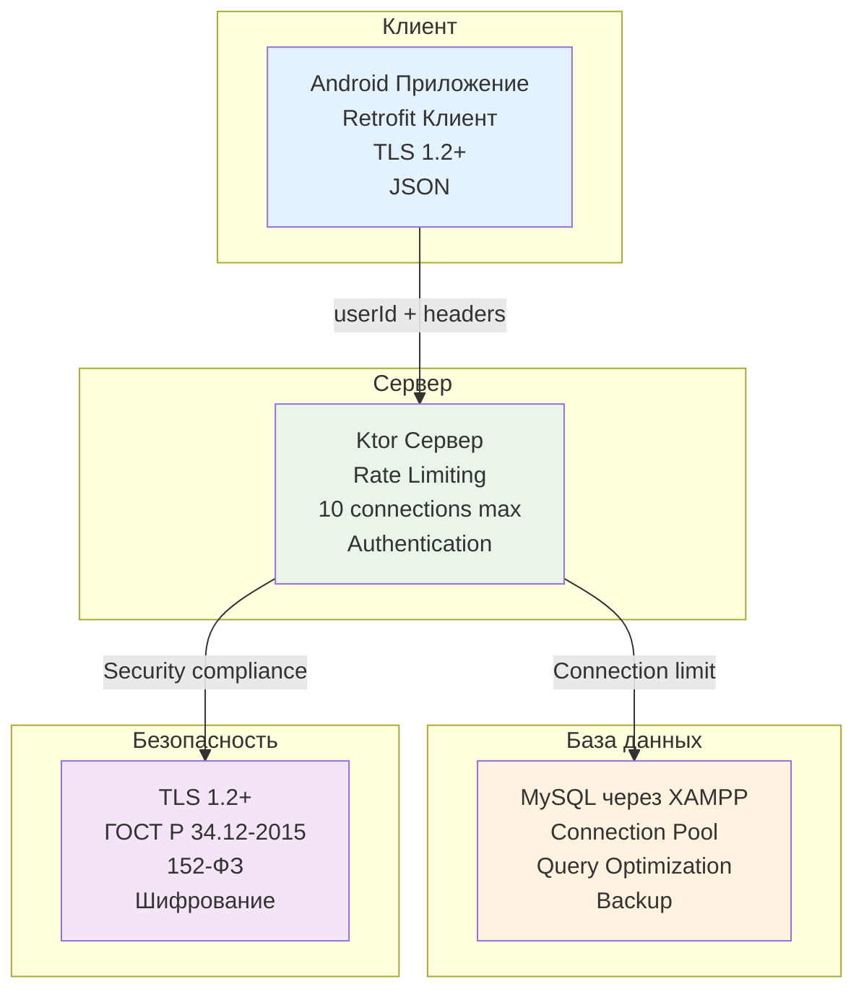
```mermaid
graph TD
    subgraph "Клиент"
        A[Android Приложение<br/>Retrofit Клиент<br/>TLS 1.2+<br/>JSON]
    end
    subgraph "Сервер"
        B[Ktor Сервер<br/>Rate Limiting<br/>10 connections max<br/>Authentication]
    end
    subgraph "База данных"
        C[MySQL через XAMPP<br/>Connection Pool<br/>Query Optimization<br/>Backup]
    end
    subgraph "Безопасность"
        D[TLS 1.2+<br/>ГОСТ Р 34.12-2015<br/>152-ФЗ<br/>Шифрование]
    end
    A -->|userId + headers| B
    B -->|Connection limit| C
    B -->|Security compliance| D
    style A fill:#e3f2fd
    style B fill:#e8f5e8
    style C fill:#fff3e0
    style D fill:#f3e5f5
```

**Вывод:** Диаграмма повышает безопасность, помогая администраторам настроить сервер. Разработчики реализуют ограничения, а QA тестируют стресс-сценарии, обеспечивая соответствие законодательству.

## 4. Динамические диаграммы

### 4.1. Sequence-диаграмма (авторизация)

**Описание:** Диаграмма показывает анонимную авторизацию: клиент отправляет POST /auth, Ktor генерирует userId, сохраняет в MySQL (users) и возвращает { "userId": "ANON_123" }. Используется TLS 1.2+.

```mermaid
sequenceDiagram
    participant A as Android
    participant S as Ktor Сервер
    participant D as MySQL
    A->>S: POST /auth
    S->>D: INSERT INTO users
    D-->>S: userId
    S-->>A: 200 OK, userId
```

**Вывод:** Диаграмма упрощает реализацию авторизации и тестирование (MockWebServer). Разработчики оптимизируют задержки, а QA проверяют ошибки базы данных, обеспечивая быстрый вход.

### 4.2. State-диаграмма (состояния сессии)

**Описание:** Диаграмма описывает состояния сессии: Новая (вход), Активная (чат/мини-игра), Сохранено локально (офлайн), Синхронизация (Wi-Fi), Завершённая (выход). Это поддерживает автосохранение и офлайн-режим.

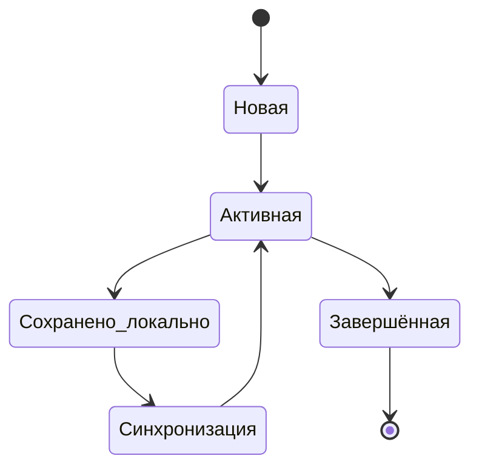
```mermaid
stateDiagram-v2
    [*] --> Новая
    Новая --> Активная
    Активная --> Сохранено_локально
    Сохранено_локально --> Синхронизация
    Синхронизация --> Активная
    Активная --> Завершённая
    Завершённая --> [*]
```

**Вывод:** Диаграмма помогает разработчикам управлять сессией, а QA — тестировать офлайн-сценарии. Она улучшает UX, минимизируя потери прогресса при сбоях Wi-Fi.

### 4.3. Activity-диаграмма (сохранение прогресса)

**Описание:** Диаграмма описывает сохранение: игрок делает выбор, приложение проверяет Wi-Fi, сохраняет в Room (офлайн) или отправляет POST /save-progress (онлайн). Данные синхронизируются при подключении.

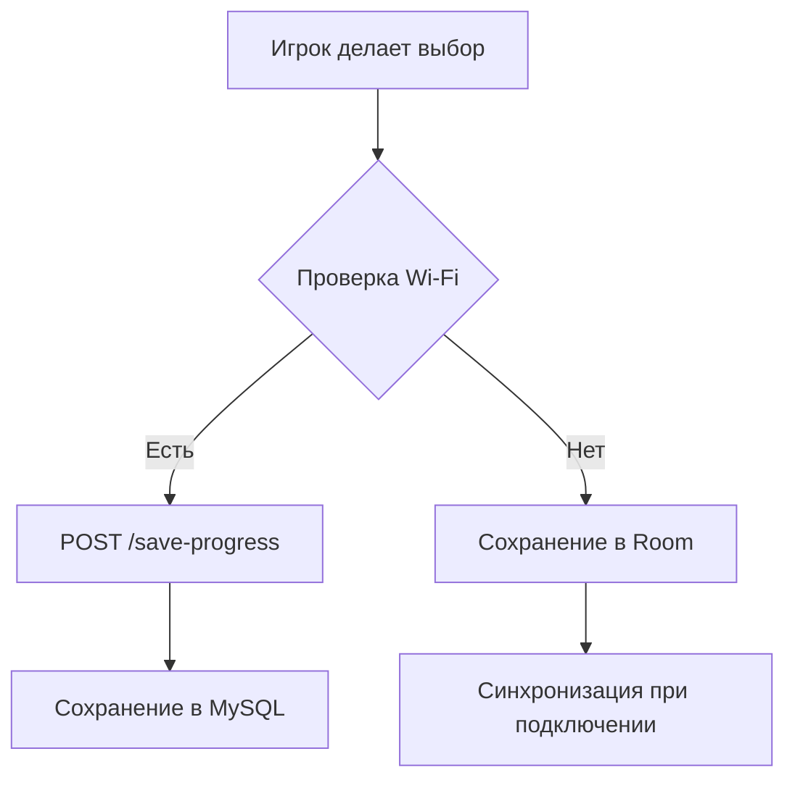
```mermaid
graph TD
    A[Игрок делает выбор] --> B{Проверка Wi-Fi}
    B -- Есть --> C[POST /save-progress]
    B -- Нет --> D[Сохранение в Room]
    C --> E[Сохранение в MySQL]
    D --> F[Синхронизация при подключении]
```

**Вывод:** Диаграмма обеспечивает надёжное автосохранение, упрощая реализацию и тестирование. Разработчики минимизируют потери данных, а QA проверяют офлайн-сценарии, улучшая UX.

### 4.4. Timing-диаграмма

**Описание:** Диаграмма показывает временные последовательности: запуск (0 мс), загрузка дня (100 мс), выбор игрока (200 мс), синхронизация (250–300 мс). Это оптимизирует производительность на устройствах с 2 ГБ RAM.

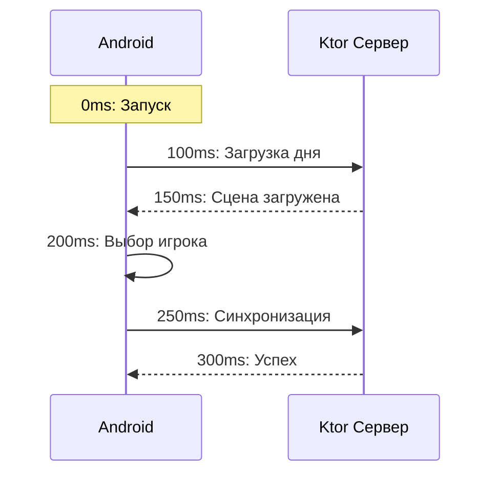
```mermaid
sequenceDiagram
    participant A as Android
    participant S as Ktor Сервер
    Note over A: 0ms: Запуск
    A->>S: 100ms: Загрузка дня
    S-->>A: 150ms: Сцена загружена
    A->>A: 200ms: Выбор игрока
    A->>S: 250ms: Синхронизация
    S-->>A: 300ms: Успех
```

**Вывод:** Диаграмма помогает разработчикам оптимизировать отклик, а QA — тестировать производительность на слабых устройствах. Она выявляет узкие места (например, синхронизация), улучшая UX.

## 5. Игровые диаграммы

### 5.1. Game Loop

**Описание:** Диаграмма описывает цикл игры: загрузка (Room/JSON), рендеринг UI (Compose), обработка ввода (выборы, мини-игры), обновление состояния (флаги, прогресс). Это обеспечивает 60 FPS для чата и мини-игр.

```mermaid
graph TD
    загрузка[Загрузка] --> рендеринг[Рендеринг UI]
    рендеринг --> обработкаВвода[Обработка ввода]
    обработкаВвода --> обновлениеСостояния[Обновление состояния]
    обновлениеСостояния --> загрузка
```

**Вывод:** Диаграмма помогает разработчикам организовать движок, а QA — тестировать плавность. Геймдизайнеры используют её для интеграции механик, а менеджеры — для оценки производительности.

### 5.2. Диаграмма ветвления сцен и диалогов

**Описание:** Диаграмма показывает сцены и диалоги: День 1 включает Сцену 1A/1B, выборы ведут к Дню 2A/2B. Это основа ветвящегося сюжета (10 дней, 60+ путей), влияющего на NPC и концовки.

```mermaid
graph LR
    день1[День 1] --> сцена1A[Сцена 1A]
    день1 --> сцена1B[Сцена 1B]
    сцена1A --> выбор1[Выбор 1]
    сцена1A --> выбор2[Выбор 2]
    выбор1 --> день2A[День 2A]
    выбор2 --> день2B[День 2B]
```

**Вывод:** Диаграмма помогает геймдизайнерам проектировать сюжет, а QA — тестировать пути. Разработчики реализуют ветвление (Room, Ktor), а менеджеры оценивают реиграбельность.

### 5.3. Диаграмма состояний персонажа

**Описание:** Диаграмма описывает отношения с NPC (Алексей, Елена): Нейтральный, Дружелюбный, Враг. Выборы игрока (например, доверие Елене) определяют переходы, влияя на сюжет.

```mermaid
stateDiagram-v2
    [*] --> Нейтральный
    Нейтральный --> Дружелюбный
    Нейтральный --> Враг
    Дружелюбный --> Нейтральный
    Враг --> Нейтральный
```

**Вывод:** Диаграмма упрощает моделирование отношений, помогая геймдизайнерам создавать дилеммы. Разработчики реализуют флаги, а QA тестируют влияние выборов, обеспечивая динамичность.

### 5.4. Диаграмма баланса игры

**Описание:** Диаграмма показывает соотношение: диалоги (30%), мини-игры (40%), концовки (20%), документы (10%). Это балансирует опыт для аудитории 16+.

```mermaid
pie
    title Баланс игровых элементов
    "Диалоги" : 30
    "Мини-игры" : 40
    "Концовки" : 20
    "Документы" : 10
```

**Вывод:** Диаграмма помогает геймдизайнерам сбалансировать контент, а QA — тестировать равномерность. Менеджеры планируют DLC, а разработчики оптимизируют ресурсы.

### 5.5. Диаграмма прогрессии

**Описание:** Диаграмма показывает переходы: День 1 → День 2 → Финал, с ветвлением (День 2A/2B). Это обеспечивает линейность с вариативностью.

```mermaid
graph LR
    день1[День 1] --> день2[День 2]
    день2 --> день3[День 3]
    день3 --> финал[Финал]
```

**Вывод:** Диаграмма помогает геймдизайнерам структурировать дни, а QA — проверять концовки. Разработчики реализуют прогрессию в Room, а менеджеры оценивают длительность игры.

## 6. UI/UX диаграммы

### 6.1. User Flow

**Описание:** Диаграмма описывает путь игрока: запуск, вход (анонимный), чат (диалоги с NPC), выборы, мини-игры, сохранение, выход. Это обеспечивает интуитивный UX в тёмной теме.

```mermaid
graph TD
    запуск[Запуск] --> вход[Вход]
    вход --> чат[Чат]
    чат --> выбор[Выбор]
    выбор --> миниИгра[Мини-игра]
    миниИгра --> сохранение[Сохранение]
    сохранение --> выход[Выход]
```

**Вывод:** Диаграмма помогает UX-дизайнерам создать интуитивный интерфейс, а QA — тестировать сценарии. Разработчики реализуют NavController, а менеджеры презентуют UX заказчикам.

### 6.2. Диаграмма навигации

**Описание:** Диаграмма показывает навигацию Jetpack Navigation: nav_start → nav_chat → nav_minigame → nav_settings → nav_endings. Это обеспечивает плавные переходы в портретном режиме.

```mermaid
graph LR
    старт[nav_start] --> чат[nav_chat]
    чат --> миниИгра[nav_minigame]
    чат --> настройки[nav_settings]
    миниИгра --> концовки[nav_endings]
```

**Вывод:** Диаграмма упрощает настройку NavController, минимизируя баги. QA тестируют маршруты, а разработчики обеспечивают плавность переходов, улучшая UX.

### 6.3. Диаграмма состояний UI

**Описание:** Диаграмма описывает состояния UI: Загрузка (прогресс-бар), Активный (чат/мини-игра), Оффлайн (уведомление), Завершённая (выход). Это обеспечивает стабильный UX.

```mermaid
stateDiagram-v2
    [*] --> Загрузка
    Загрузка --> Активный
    Активный --> Оффлайн
    Оффлайн --> Завершённая
    Завершённая --> [*]
```

**Вывод:** Диаграмма помогает разработчикам тестировать UI-состояния (Compose), а QA — проверять поведение при сбоях Wi-Fi. Она улучшает UX, делая интерфейс предсказуемым.

### 6.4. Прототипы экранов

**Описание:** Диаграмма показывает макеты: чат (пузырьки, кнопки выбора), мини-игра (редактор кода, кнопка «Выполнить»), настройки (тёмная тема). Это основа для портретного UI.

```mermaid
graph TD
    экранЧата[Чат] -->|Макет| пузырьки[Пузырьки сообщений]
    экранЧата --> кнопкиВыбора[Кнопки выбора]
    экранМиниИгры[Мини-игра] --> редакторКода[Редактор кода]
    экранМиниИгры --> кнопкаВыполнить[Кнопка "Выполнить"]
    экранНастроек[Настройки] --> переключательТемы[Переключатель темы]
```

**Вывод:** Диаграмма ускоряет создание UI, согласовывая дизайн и разработку. QA тестируют доступность (TalkBack), а разработчики реализуют тёмную тему, соответствующую WCAG 2.1.

## 7. Инфраструктурные диаграммы

### 7.1. Диаграмма мониторинга

**Описание:** Диаграмма показывает мониторинг через phpMyAdmin: разработчик просматривает таблицы (users, game_progress) для отладки или анализа прогресса игроков.

```mermaid
sequenceDiagram
    participant разработчик as Разработчик
    participant админПанель as phpMyAdmin
    participant базаДанных as MySQL
    разработчик->>админПанель: Вход через браузер
    админПанель->>базаДанных: SQL-запрос
    базаДанных-->>админПанель: Данные
    админПанель-->>разработчик: Визуализация
```

**Вывод:** Диаграмма упрощает администрирование, помогая выявлять проблемы с данными. Разработчики используют её для отладки, а QA — для анализа багов, повышая надёжность.

### 7.2. Диаграмма резервного копирования

**Описание:** Диаграмма описывает резервное копирование: ежедневный экспорт MySQL в CSV/JSON через phpMyAdmin и ручной экспорт. Это защищает данные от сбоев.

```mermaid
graph LR
    базаДанных[MySQL] --> ежедневнаяКопия[Ежедневная копия]
    базаДанных --> ручнойЭкспорт[Ручной экспорт CSV/JSON]
```

**Вывод:** Диаграмма помогает администраторам настроить резервное копирование, минимизируя потери данных. Разработчики используют её для восстановления базы, а QA — для тестирования бэкапов.

### 7.3. Диаграмма безопасности

**Описание:** Диаграмма показывает защиту: TLS 1.2+ для HTTP, AES-256 для Room, соответствие 152-ФЗ и ГОСТ Р 34.12-2015. Это обеспечивает безопасность данных.

```mermaid
graph TD
    subgraph "Шифрование"
        tls[TLS 1.2+<br/>HTTP трафик<br/>Сервер-клиент]
        aes[AES-256<br/>Room база<br/>Локальное хранение]
    end
    subgraph "Соответствие"
        закон152[152-ФЗ<br/>Защита данных<br/>Российское законодательство]
        гост[ГОСТ Р 34.12-2015<br/>Криптографическая защита<br/>Стандарт РФ]
    end
    tls --> закон152
    aes --> гост
    style tls fill:#e3f2fd
    style aes fill:#e8f5e8
    style закон152 fill:#fff3e0
    style гост fill:#f3e5f5
```

**Вывод:** Диаграмма обеспечивает соответствие законодательству, помогая администраторам настроить безопасность. Разработчики реализуют шифрование, а QA тестируют защиту, минимизируя риски.

### 7.4. Диаграмма масштабирования

**Описание:** Диаграмма показывает потенциальное масштабирование: добавление Redis для кэширования, балансировщик нагрузки, репликация MySQL. Это планирует рост пользователей.

```mermaid
graph LR
    subgraph "Текущая архитектура"
        ktor[Ktor Сервер<br/>Монолитный<br/>10 подключений]
        mysql[MySQL<br/>XAMPP<br/>Локальная база]
    end
    subgraph "Планируемое масштабирование"
        балансировщик[Балансировщик нагрузки<br/>Nginx<br/>Распределение запросов]
        redis[Redis Кэш<br/>Сессии<br/>Временные данные]
        репликация[Репликация MySQL<br/>Master-Slave<br/>Высокая доступность]
    end
    ktor --> балансировщик
    mysql --> репликация
    балансировщик --> redis
    style ktor fill:#e3f2fd
    style mysql fill:#e8f5e8
    style балансировщик fill:#fff3e0
    style redis fill:#f3e5f5
    style репликация fill:#fce4ec
```

**Вывод:** Диаграмма помогает архитекторам планировать рост, а менеджеры используют её для обсуждения с инвесторами. Разработчики оценивают сложность, а администраторы готовят инфраструктуру.

### 7.5. Диаграмма развертывания

**Описание:** Диаграмма описывает процесс развертывания: разработка → тестирование → staging → продакшн. Это обеспечивает стабильные обновления.

```mermaid
graph LR
    разработка[Разработка<br/>Локальная среда<br/>Kotlin + Compose] --> тестирование[Тестирование<br/>JUnit + Espresso<br/>QA проверки]
    тестирование --> staging[Staging<br/>Тестовая среда<br/>XAMPP + Ktor]
    staging --> продакшн[Продакшн<br/>Финальная версия<br/>APK + Сервер]
```

**Вывод:** Диаграмма упрощает CI/CD, помогая разработчикам автоматизировать развертывание. QA тестируют в staging, а менеджеры контролируют релизы, минимизируя риски.

---

## Заключение

Данный документ содержит 30 детальных диаграмм, охватывающих все аспекты проекта «Сообщение 404» — от архитектуры и данных до UI/UX и инфраструктуры. Каждая диаграмма предоставляет практическую ценность для различных ролей в команде:

- **Разработчики** используют диаграммы для понимания архитектуры, API и интеграций
- **Геймдизайнеры** применяют их для проектирования сюжета и игровых механик
- **QA-инженеры** создают тест-кейсы на основе диаграмм состояний и последовательностей
- **Менеджеры** презентуют технические решения заказчикам и инвесторам
- **Администраторы** настраивают инфраструктуру и мониторинг

Все диаграммы созданы с учетом специфики проекта: офлайн-режим, локальный сервер, соответствие российскому законодательству и тёмная тема. Они обеспечивают полное понимание системы и упрощают разработку, тестирование и поддержку приложения.

Диаграммы регулярно обновляются по мере развития проекта, отражая текущее состояние архитектуры и помогая команде принимать обоснованные технические решения.
