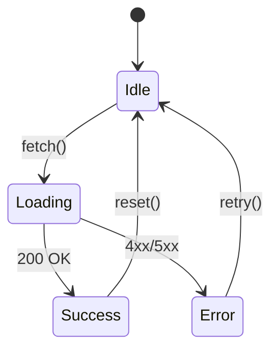

# 06. Модели поведения

**Код документа**: СХ-10-06  
**Дата обновления**: 23.06.2025  
**Версия**: 1.2  
**Разработчик**: Иванов И.И.  
**Согласовал**: Петров П.П.  
**Стандарты**: ГОСТ 19.701-90

---

## Динамические модели
Модели поведения описывают сценарии взаимодействия пользователя с системой, переходы между состояниями, обработку событий и логику ветвлений.

### Пример диаграммы состояний (Mermaid):

## Диаграммы поведения
- **Sequence Diagram**  
  
- **Activity Diagram**  
  
- **State Machine**  
  
- **Interaction Diagram**  
  _TODO: добавить диаграмму_
- **Event Flow Diagram**  
  _TODO: добавить диаграмму_ 