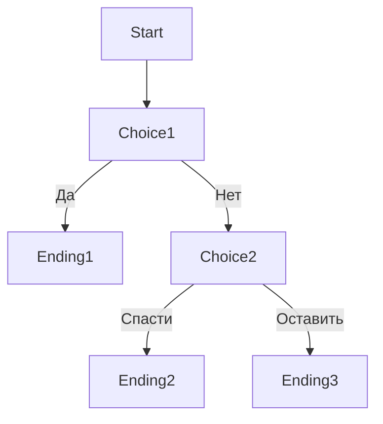

# 07. Дизайн игры

**Код документа**: СХ-10-07  
**Дата обновления**: 23.06.2025  
**Версия**: 1.2  
**Разработчик**: Иванов И.И.  
**Согласовал**: Петров П.П.  
**Стандарты**: ГОСТ 19.701-90

---

## Механики и сценарии
Дизайн игры включает ветвящиеся истории, мини-игры, условия концовок и влияние выбора игрока на развитие сюжета. Все сценарии документируются в виде диаграмм и таблиц переходов.

### Пример ветвления сюжета (Mermaid):

## Диаграммы игрового дизайна
- **Branching Story**  
  
- **MiniGame Flow**  
  
- **Ending Conditions**  
  
- **Choice Impact Diagram**  
   