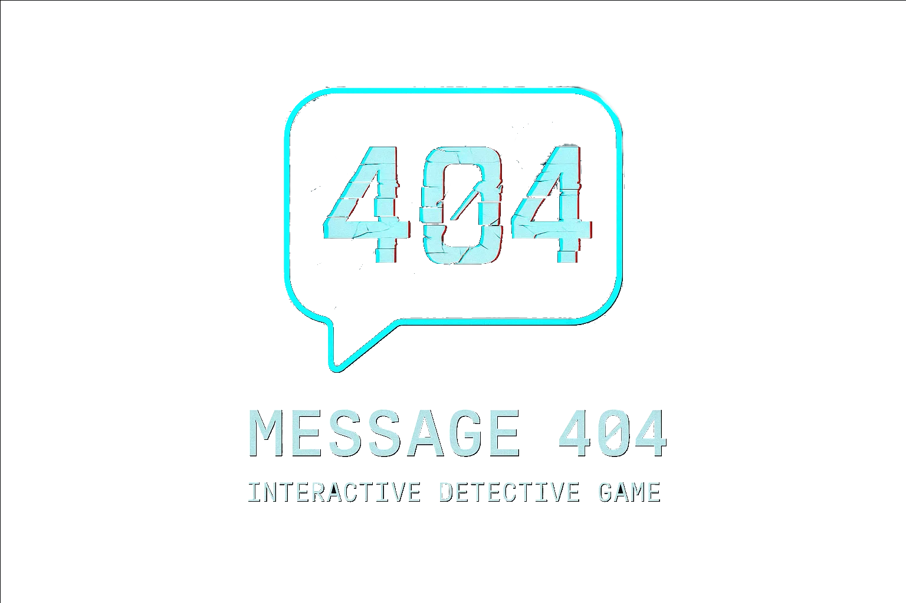
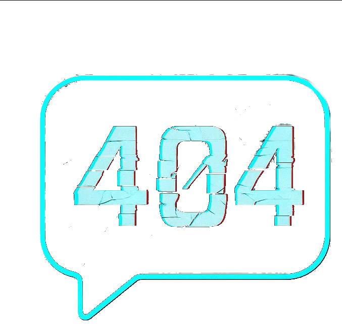

# Сообщение 404 — Документация

**Код документа**: СХ-10  
**Дата обновления**: 23.06.2025  
**Время обновления**: 15:07 CEST  
**Версия**: 1.2  
**Разработчик**: Иванов И.И.  
**Согласовал**: Петров П.П.  
**Стандарты**: ГОСТ 19.701-90, ISO/IEC 12207, ISO/IEC 25010

---

## Оглавление

1. [Введение](01_INTRODUCTION.md)
2. [Требования](02_REQUIREMENTS.md)
3. [Архитектура](03_ARCHITECTURE.md)
4. [Модель данных](04_DATA_MODEL.md)
5. [Спецификация API](05_API_SPECIFICATION.md)
6. [Модели поведения](06_BEHAVIOR_MODEL.md)
7. [Дизайн игры](07_GAME_DESIGN.md)
8. [UI/UX-дизайн](08_UI_UX_DESIGN.md)
9. [Инфраструктура](09_INFRASTRUCTURE.md)
10. [Руководство по развертыванию](10_DEPLOYMENT_GUIDE.md)
11. [Руководство разработчика](11_DEVELOPMENT_GUIDE.md)
12. [Юридические документы](12_LEGAL.md)
13. [Диаграммы](diagrams/)
14. [Ресурсы](assets/)
15. [История изменений](CHANGELOG.md)

---

## Описание

Данная документация структурирована в соответствии с профессиональными стандартами и предназначена для комплексного сопровождения проекта «Сообщение 404».

- Все разделы снабжены метаинформацией.
- Диаграммы вынесены в отдельные категории.
- Документация поддерживает масштабирование и развитие проекта.

---

## Примеры ресурсов

> Все дополнительные изображения и схемы размещаются в папке docs/assets/ и могут быть использованы в любой части документации. 